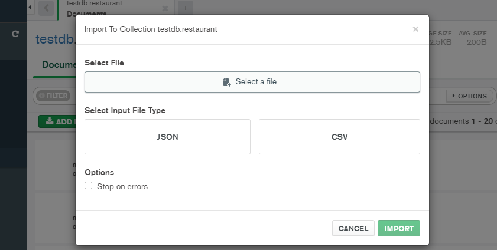

# Follow below steps to import and extract data from the source file to mongodb.

once you up the server it will create the relevant mongodb collection as schemas define, you can run the following command to import data to mongodb.

## Import data to mongodb using mongodb compass.

select restaurants.csv file and import it to mongodb.

## Extract data from mongodb to csv file using mongo export command line

installation guide for mongo export command line:
https://docs.mongodb.com/database-tools/mongoexport/

command:
mongoimport --type csv -d testdb -c restaurant --headerline --drop restaurants.csv
